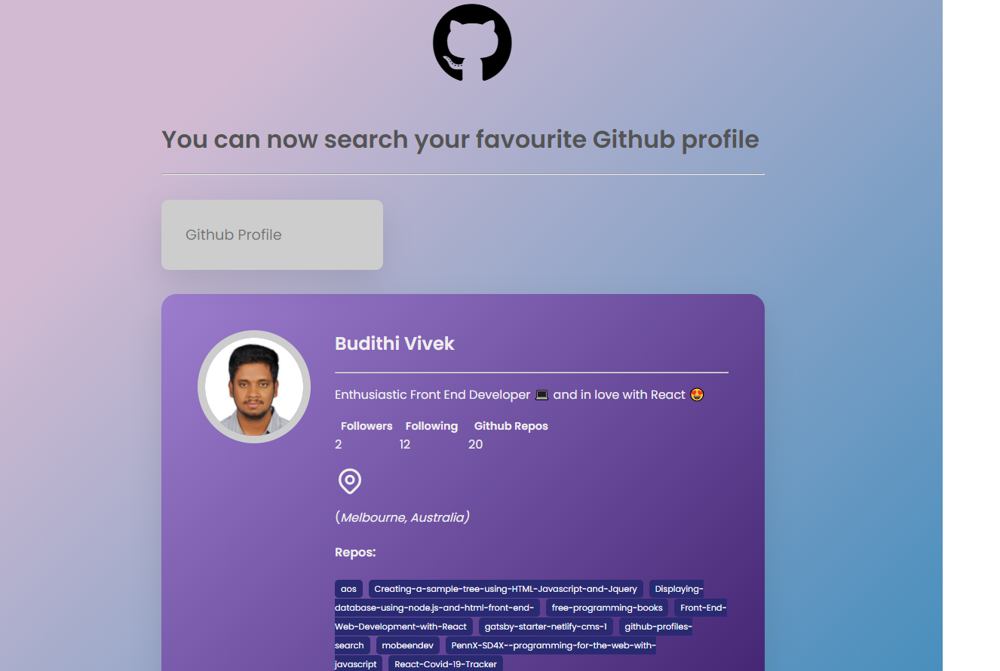

# GitHub Profile Search

A Web Application built to search the profiles in GitHub. It is built using HTML, CSS and VanillaJs.

 

LinkedIn Profile - **[Vivek Budithi](https://www.linkedin.com/in/vivek-budithi-a27321151/)**  

## API

API GitHub Users- https://api.github.com/users/

API Resource - https://developer.github.com/v3/

## Web App Output

## How to use

- Fork and clone the repository.
- Open in the live sever or just open the index.html.

